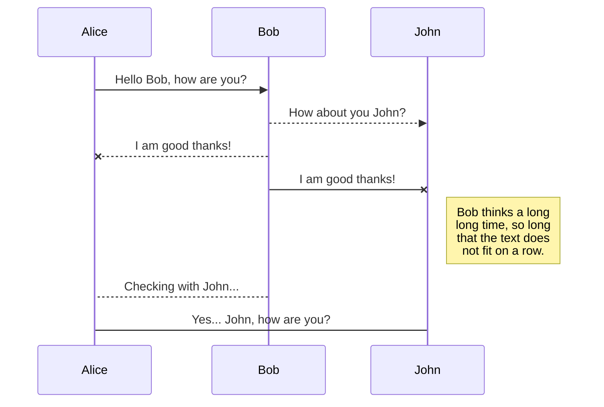
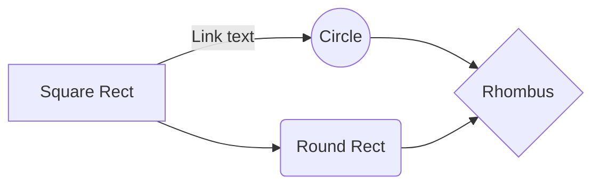

# PROJECT MANAGEMENT (SCRUM) PRACTICES

## Pre "Code Challenge" Discussions

As ETG Consultancy Inc. (from now on stated as "We" or "Etg"), we developed a solution approach before getting to know the rules of Code Challenge for Capital Asset Planning System Modernization (CAPS) Project. We decided to present the Province with two different solutions where one of them would be based on Modern Web Programming stack and the other based on Microsoft Dynamics 365 F&O. In this regard, we prepared a demo project for the sample project given in "Code Challenge.pdf" document using Scrum methodology and modern web stack (Vue.js, postgresql, .net and github). In the mean time, we discussed about a Dynamics 365 F&O approach/solution as well (which we didn't implement this solution).

The roles of the team has been decided as;
- Selami Kul - Product Owner
- Celal Unver - Scrum Master
- Mesut Boztas - Development Team - Dynamics Expert
- Enver Yilmaz - Development Team - Backend, Dynamics
- Ender Yilmaz - Development Team - Backend, Dynamics
- Salim Serdar - Development Team - Frontend
- Tufan Bilge - Development Team - Backend, Frontend

The team has decided to get together everyday twice for Daily Scrum meetings because of the time constraint. Team also has decided to have a Sprint Review Meeting on 9th of September Monday morning at 9:30 PST (right after the Code Challenge issued and the team had a chance to study Code Challenge requirements)

## "Code Challenge" Sprint Review Meeting - Sep 9 - 9:30am
The team met on 9th of September Monday at 9:30. The team members already examined the issued Readme.md file for the Code Challenge by the Province. The team has concluded the following decisions and the related action items;

- Decision 1 - The solution requested by the Province is a Dynamics based solution. So, the team decided to issue only one solution based on Dynamics 365 F&O. The team will use Microsoft Teams environment for communication, file sharing and meeting scheduling and DevOps environment for Product Backlog, task management and code implementation using Scrum methodology

- Decision 2 - The team for the Code Challenge has been formed as follows;
  * Product Owner - Selami Kul
  * Scrum Master - Celal Unver
  * Development Team - Mesut Boztas (Dynamics Expert)
  * Development Team - Enver Yilmaz (Dynamics Developer - Tester)

- Decision 3 - User roles for the User Stories have been discussed by the Team. Finally come to an agreement that new temporary Etg users should be created within Etg domain for the Province to access Dynamics 365 F&O Server maintained by Etg.
  + Action Item 1 - Scrum Master to facilitate and have new users opened 

- Decision 4 - Use cases already been given by the Province as User Stories. The team decided that these are also our PBI's.
  * Action Item 2 - Mesut Boztas to open a new project under DevOps
  * Action Item 3 - Scrum Master to define PBI's on DevOps environment under new project
  * Action Item 4 - Mesut Boztas and Enver Yilmaz to discuss all the tasks related with PBIs, share the work and start the implementation of the Code Challenge

- Decision 5 – After carefully examining the User Stories, the team is confident to implement the Code Challenge using Dynamics F&O infrastructure, except;
  * Issue 1 – The team is not sure whether the User will be redirected to Login page after logging out. This is Microsoft's default behavior and out of Etg's hands. This will be tested and will be discussed further in the upcoming meetings.
  * Update 1 – Etg team thinks a “Planned” status should be added as the 4th label to project status labels (Created, Submitted, Approved)
- Decision 6 – Today's daily scrum meeting cancelled, the team will meet Sep 10 in the morning again.
- Decision 7 - The tea
#Conclusion of the Sprint Review Meeting#

## "Code Challenge" Daily Scrum Meeting - 1 - Sep 10 - 9:30 am
Team get together online on Microsoft Teams platform and discussed the.

### WORK THAT HAS DONE
- Project and Model created (Infrastructure - concluded PBI-1)
- Temporary Etg Users added to the system and necessary roles/rights have been defined, for the use of Province
- User login and logout functionality implemented (concluded PBIs 2 and 3)
   * Issue 1 tested and resolved. The system works as described in the User Story #2 
- Project creation workflow implemented and tested (concluded PBI-4)
- Documentation started, Sprint Review Meeting is added to documentation 
### WORK TO BE DONE
- PBI's 5,6 and 7 will be implemented and unit tested today
- The team decided to finish the implementation of Code Challenge today. 
- The whole User stories will be tested back to back today
- The team decided to put test cases (with screenshots) as well as a User manual to documentation.
- The team decided to create a new Workspace

### IMPEDIMENTS
- No known/defined impediment

## "Code Challenge" Daily Scrum Meeting - 2
## "Code Challenge" Sprint Review Meeting

# Publication

Publishing in StackEditPro makes it simple for you to publish online your files. Once you're happy with a file, you can publish it to different hosting platforms like **Blogger**, **Dropbox**, **Gist**, **GitHub**, **Google Drive**, **WordPress** and **Zendesk**. With [Handlebars templates](http://handlebarsjs.com/), you have full control over what you export.

> Before starting to publish, you must link an account in the **Publish** sub-menu.

## Publish a File

You can publish your file by opening the **Publish** sub-menu and by clicking **Publish to**. For some locations, you can choose between the following formats:

- Markdown: publish the Markdown text on a website that can interpret it (**GitHub** for instance),
- HTML: publish the file converted to HTML via a Handlebars template (on a blog for example).

## Update a publication

After publishing, StackEditPro keeps your file linked to that publication which makes it easy for you to re-publish it. Once you have modified your file and you want to update your publication, click on the **Publish now** button in the navigation bar.

> **Note:** The **Publish now** button is disabled if your file has not been published yet.

## Manage file publication

Since one file can be published to multiple locations, you can list and manage publish locations by clicking **File publication** in the **Publish** sub-menu. This allows you to list and remove publication locations that are linked to your file.

# Markdown extensions

StackEditPro extends the standard Markdown syntax by adding extra **Markdown extensions**, providing you with some nice features.

> **ProTip:** You can disable any **Markdown extension** in the **File properties** dialog.

## SmartyPants

SmartyPants converts ASCII punctuation characters into "smart" typographic punctuation HTML entities. For example:

|                |ASCII                          |HTML                         |
|----------------|-------------------------------|-----------------------------|
|Single backticks|`'Isn't this fun?'`            |'Isn't this fun?'            |
|Quotes          |`"Isn't this fun?"`            |"Isn't this fun?"            |
|Dashes          |`-- is en-dash, --- is em-dash`|-- is en-dash, --- is em-dash|

## KaTeX

You can render LaTeX mathematical expressions using [KaTeX](https://khan.github.io/KaTeX/):

The *Gamma function* satisfying $\Gamma(n) = (n-1)!\quad\forall n\in\mathbb N$ is via the Euler integral

$$
\Gamma(z) = \int_0^\infty t^{z-1}e^{-t}dt\,.
$$

> You can find more information about **LaTeX** mathematical expressions [here](http://meta.math.stackexchange.com/questions/5020/mathjax-basic-tutorial-and-quick-reference).

## UML diagrams

You can render UML diagrams using [Mermaid](https://mermaidjs.github.io/). For example, this will produce a sequence diagram:

And this will produce a flow chart:

<!--stackedit_data:
eyJoaXN0b3J5IjpbLTIwMzE0MjU0MzgsMzM3MzAxODA4LC03ND
k0NzY0MzEsLTcxNjQ2OTc4MywtMTg0MjU0OTMyLDE0NDkzNjk1
OTIsLTk0MTM5MDI5OSw1MzAxMjExNiwtMTU2ODgzMzQ1MiwxMj
gwNjMzMDAyLDEwMTY3NTQ4Ml19
-->